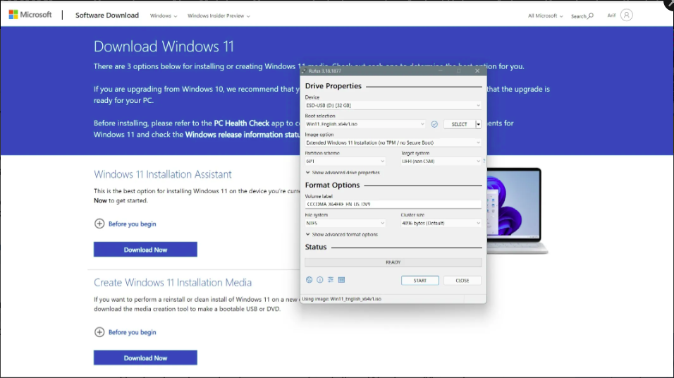
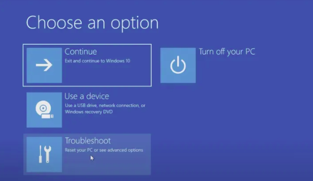
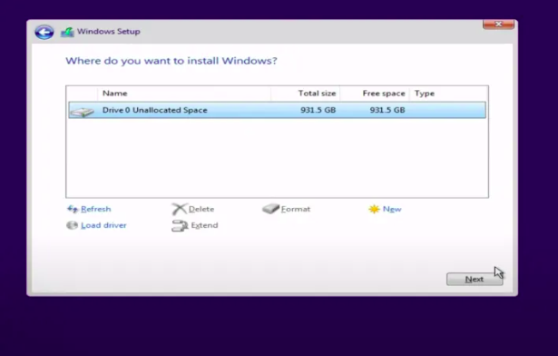
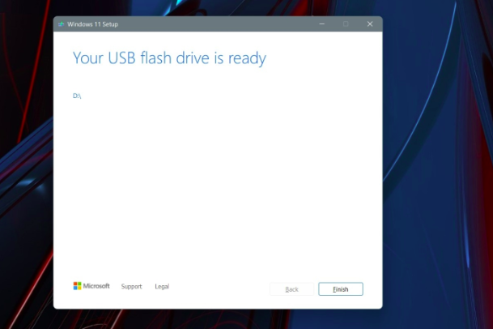
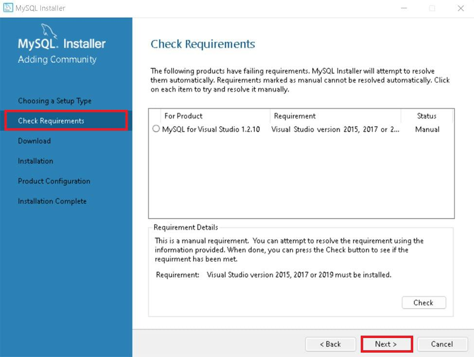
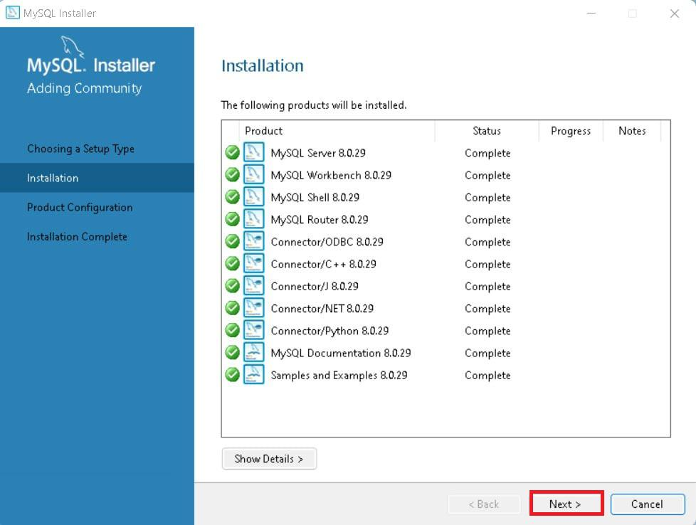
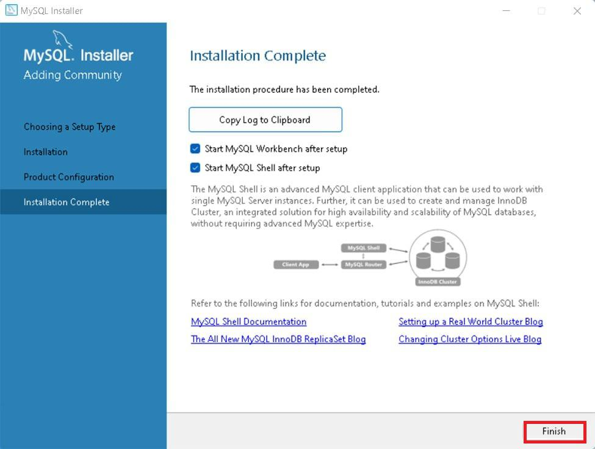

[](https://classroom.github.com/a/vbnbTt5m)
[](https://classroom.github.com/online_ide?assignment_repo_id=15236630&assignment_repo_type=AssignmentRepo)
# Dev_Setup
Setup Development Environment

#Assignment: Setting Up Your Developer Environment

#Objective:
This assignment aims to familiarize you with the tools and configurations necessary to set up an efficient developer environment for software engineering projects. Completing this assignment will give you the skills required to set up a robust and productive workspace conducive to coding, debugging, version control, and collaboration.

#Tasks:

1. Select Your Operating System (OS):
   Choose an operating system that best suits your preferences and project requirements. Download and Install Windows 11. https://www.microsoft.com/software-download/windows11

2. Install a Text Editor or Integrated Development Environment (IDE):
   Select and install a text editor or IDE suitable for your programming languages and workflow. Download and Install Visual Studio Code. https://code.visualstudio.com/Download
3. Set Up Version Control System:
   Install Git and configure it on your local machine. Create a GitHub account for hosting your repositories. Initialize a Git repository for your project and make your first commit. https://github.com

4. Install Necessary Programming Languages and Runtimes:
  Instal Python from http://wwww.python.org programming language required for your project and install their respective compilers, interpreters, or runtimes. Ensure you have the necessary tools to build and execute your code.

5. Install Package Managers:
   If applicable, install package managers like pip (Python).

6. Configure a Database (MySQL):
   Download and install MySQL database. https://dev.mysql.com/downloads/windows/installer/5.7.html

7. Set Up Development Environments and Virtualization (Optional):
   Consider using virtualization tools like Docker or virtual machines to isolate project dependencies and ensure consistent environments across different machines.

8. Explore Extensions and Plugins:
   Explore available extensions, plugins, and add-ons for your chosen text editor or IDE to enhance functionality, such as syntax highlighting, linting, code formatting, and version control integration.

9. Document Your Setup:
    Create a comprehensive document outlining the steps you've taken to set up your developer environment. Include any configurations, customizations, or troubleshooting steps encountered during the process. 

#Deliverables:
- Document detailing the setup process with step-by-step instructions and screenshots where necessary.
- A GitHub repository containing a sample project initialized with Git and any necessary configuration files (e.g., .gitignore).
- A reflection on the challenges faced during setup and strategies employed to overcome them.

#Submission:
Submit your document and GitHub repository link through the designated platform or email to the instructor by the specified deadline.

#Evaluation Criteria:**
- Completeness and accuracy of setup documentation.
- Effectiveness of version control implementation.
- Appropriateness of tools selected for the project requirements.
- Clarity of reflection on challenges and solutions encountered.
- Adherence to submission guidelines and deadlines.

Note: Feel free to reach out for clarification or assistance with any aspect of the assignment.


# Answers: Setting Up Your Developer Environment

## 1. Installing Windows 11

### How to Clean Install with Windows 11 Installation Media

#### Steps:

**Create Installation Media:**

1. Visit the [Windows 11 download page](https://www.microsoft.com/software-download/windows11).
2. Select "Create Installation Media" and download the tool.

**Run the Setup Tool:**

1. Open the downloaded tool.
2. Agree to the terms and choose "Accept."
3. Select "Use the recommended options for this PC" and click "Next."
4. Choose "USB flash drive" and click "Next."

   

**Create Bootable USB:**

1. Select your USB flash drive from the list and click "Next."
2. The tool will download Windows 11 and create the installation media.
3. Once done, you’ll get a prompt that the drive is ready. Click "Finish."

**Boot from USB:**

1. Keep the USB drive plugged in.
2. Go to `Settings > Update & Security > Recovery`.
3. Under "Advanced startup," select "Restart now."
4. In the prompt, choose "Use a device," and select your USB drive.

   

**Install Windows 11:**

1. The PC will restart to the Windows 11 installer.
2. Select your language and click `Next`.
3. Choose the version of Windows 11 that matches your current version of Windows 10 and click `Next`.

**Custom Installation:**

1. Select `Custom` installation.
2. Choose the drive to install Windows 11 on. You may need to format the drive to erase all files.
3. Click `Next` to start the installation.

   

**Complete Installation:**

1. Windows 11 will install, and you can sit back.
2. Once installation is complete, follow the prompts to set up your PC.


## 2. Installing Visual Studio Code

### Step-by-Step Installation Guide:

**Step 1. Download Visual Studio Code:**
   - Visit [Visual Studio Code download page](https://code.visualstudio.com/Download).
   - Select "Download for Windows".

   

**Step 2. Wait for the download to finish and locate the installer in your Downloads folder.**

**Step 3. Initiate the Installation:**
   - Double-click on the downloaded installer to begin the installation process.

**Step 4. Accept Terms and Conditions:**
   - Once the installer opens, accept the terms and conditions of Visual Studio Code.
   - Click "I Accept the agreement" and then click the "Next" button.

   

**Step 5. Choose Installation Location:**
   - Choose the location where Visual Studio Code will be installed.
   - Click the "Next" button after selecting the location.

   

**Step 6. Begin Installation:**
   - Click on the "Install" button to start the installation setup.

   

**Step 7. Installation Progress:**
   - Wait for the installation process to complete (approximately 1 minute).

**Step 8. Complete Installation:**
   - After the installation setup for Visual Studio Code finishes, a completion window will appear.
   - Tick the checkbox (if any) and click "Next".

   

**Step 9. Visual Studio Code is Ready:**
   - Visual Studio Code will open successfully and you can start using it for your development tasks.


## 3. Version Control Setup

### Step-by-Step Guide:

**Step 1. Download Git for Windows:**
   - Visit [Git for Windows download page](https://gitforwindows.org/).
   - Download the latest version suitable for your system.

**Step 2. Install Git:**
   - Run the downloaded installer to start the Git setup wizard.
   - Follow the prompts by clicking "Next" and then "Finish" to complete the installation.

**Step 3. Create a GitHub Account:**
   - Visit [GitHub](https://github.com) and sign up for a new account if you don't have one already.

**Step 4. Configure Git:**
   - Open Git Bash.
   - Configure your Git username and email with the following commands:
     ```sh
     git config --global user.name "Austinkuria"
     git config --global user.email "kuriaaustin125@gmail.com"
     ```

**Step 5. Navigate to Your Project Directory:**
   - In Git Bash, navigate to your project folder using:
     ```sh
     cd Desktop/myfolder
     ```
     Or create a new project directory and navigate into it:
     ```sh
     mkdir project_name
     cd project_name
     ```

**Step 6. Initialize, Commit, and Push to GitHub:**
   - Initialize a Git repository in your project folder:
     ```sh
     git init
     ```
   - Add all files to the repository:
     ```sh
     git add .
     ```
   - Commit your changes with a commit message:
     ```sh
     git commit -m "My first commit"
     ```
   - Push your local repository to GitHub:
     ```sh
     git push origin main
     ```


## 4. Python Installation

### Step-by-Step Guide:

**a) Download Python:**
   - Visit the official Python website [python.org](https://www.python.org/).
   - Download the latest version of Python.

   

**b) Install Python:**
   - Select the "Windows installer" option and click "Download".
   - Once downloaded, run the installer.
   - Check the boxes "Use admin privileges when installing py.exe" and "Add python.exe to PATH" to avoid manual adjustments in environment variables later.

   

**c) Follow Installation Instructions:**
   - Follow the on-screen instructions to complete the installation.
   - Once installation is complete, you should see a confirmation message.

**d) Verify Installation:**
   - Open a command prompt and verify the installation by typing:
     ```sh
     python --version
     ```

   

## 5. Installing Package Managers

- Check if `pip` is installed by running the following command in the command prompt:
   ```sh
   pip --version


## 6. Configure MySQL

### Step-by-Step Guide:

**a) Download MySQL:**
   - Visit [MySQL download page](https://dev.mysql.com/downloads/installer/).
   - Click on the first download button to download MySQL.

   

**b) Start Download:**
   - On the MySQL homepage, click "No thanks, just start my download" to proceed with MySQL downloading.

   

**c) Run the Installer:**
   - After downloading the MySQL installer file, locate it in your downloads folder and double-click to run the installer.

   

**d) Choose Setup Type:**
   - The installer will prompt you to choose a setup type. For most users, "Developer Default" is recommended. Click "Next" to proceed.

   

**e) Execute Installation:**
   - In the download section, click "Execute" to start downloading the selected components.
   - Click "Next" once the download is complete.

   

**f) Product Configuration:**
   - Proceed through the "Product configuration", "Type and Networking", and "Authentication Method" pages by clicking "Next".

**g) Set Root Password:**
   - Create a strong and memorable password for the MySQL root user.
   - Click "Next" to proceed.

**h) Connect to Server:**
   - Enter the root password, click "Check".
   - If it says "Connection Succeeded," you have successfully connected to the server.

**i) Complete Installation:**
   - Once the installation is complete, click "Finish".

   

**j) Verify Installation:**
   - Open MySQL command line client from your Start Menu.
   - Log in using the root user credentials you set during installation.


## Explore Extensions and Plugins

**Visual Studio Code Extensions:**
   - **Python**: Provides rich support for the Python language, including features like IntelliSense, linting, and debugging.
   - **ESLint**: Integrates ESLint into VS Code, which helps find and fix problems in your JavaScript code.
   - **Prettier**: An opinionated code formatter that supports many languages.
   - **GitLens**: Enhances the built-in Git capabilities in VS Code, providing more insights and features.
   - **Live Server**: Launches a local development server with a live reload feature for static and dynamic pages.

###  GitHub Repository

- **Repository Link:** [Veritas Travels](https://github.com/Austinkuria/Veritas-Travels)
- **Contents:**
  - Initialized Git repository with a sample project.
  - Necessary configuration files

###  Reflection on Challenges and Strategies

**Challenges Faced:**

1. **Windows 11 Installation:**
   - Difficulty in creating bootable USB due to incompatible USB drives.
   - Solution: Used a different USB drive and ensured it was formatted correctly before creating installation media.

2. **Installing Visual Studio Code:**
   - Initial issues with setting up environment variables.
   - Solution: Followed a detailed guide to ensure all necessary checkboxes were selected during installation.

3. **Version Control Setup:**
   - Trouble configuring Git due to conflicting global configurations.
   - Solution: Reset global configurations and ensured correct user details were set.

4. **Python Installation:**
   - Encountered PATH issues after installation.
   - Solution: Selected the option to add Python to PATH during installation and verified using command prompt.

5. **MySQL Configuration:**
   - Issues with server connection due to incorrect root password setup.
   - Solution: Reinstalled MySQL and carefully set a new root password, ensuring it matched during verification.

**Strategies Employed:**

- **Detailed Documentation:** Followed step-by-step guides and official documentation for each tool and software.
- **Community Support:** Sought help from online forums and community support for troubleshooting issues.
- **Trial and Error:** Experimented with different configurations and settings to find optimal solutions.
- **Regular Verification:** Regularly verified each installation and configuration step to ensure everything was set up correctly before proceeding.